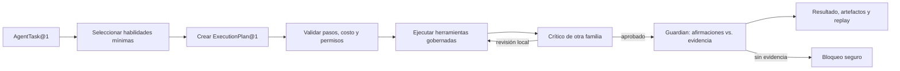

# Kronara v0.2 — Runtime cognitivo gobernado

## Resultado

Kronara no intenta ser “más inteligente” mediante un prompt monolítico. Su capacidad proviene de combinar modelos especializados con planificación explícita, habilidades versionadas, contexto citado, herramientas mínimas, crítica independiente, verificación y aprendizaje medido. El sistema conserva decisiones auditables, no razonamiento privado paso a paso.

## Ciclo de una tarea

Antes de ejecutar se comprueba que el catálogo cubra todas las capacidades solicitadas, que el crítico sea independiente, que el plan esté dentro del máximo de pasos, llamadas y costo, y que cada herramienta pertenezca a la lista del agente. Las revisiones son locales y limitadas para evitar ciclos de reescritura.

## Capacidades incorporadas

- Enrutamiento por capacidades: Qwen para planificación y estructura; Kimi para contexto largo y crítica; proveedores de baja latencia o modelos locales para tareas acotadas.
- Habilidades bajo demanda: el registro encuentra el conjunto mínimo que cubre una tarea. Una habilidad tiene versión, capacidades y URI de instrucciones; no concede permisos.
- Herramientas gobernadas: registro cerrado, allowlist por agente, argumentos estructurados, side effects declarados, anti-loop y circuit breaker.
- Contexto resistente a inyecciones: política, memoria interna, evidencia verificada y fuentes externas ocupan zonas distintas. Las fuentes externas siempre se delimitan como datos no confiables y conservan cita.
- Memoria explícita: checkpoints para reanudar; episodios para replay; conocimiento con procedencia; rendimiento como hipótesis con vigencia.
- Equipo de revisión: escritor y Automated QC usan familias distintas cuando hay alternativa sana. El crítico no publica ni se autocertifica.
- Guardian: toda afirmación operacional debe estar cubierta por `EvidenceRef` con confianza suficiente.
- Privacidad de razonamiento: se registra `decision_summary`, plan, herramientas, costos, evidencia y artefactos; no se guarda cadena de pensamiento.
- Evaluación continua: golden set normal y adversarial detecta regresiones de originalidad, causalidad, calidad, inyección y finales inválidos.

## Catálogo de agentes

Los manifiestos viven en `config/agents`. Cada uno fija rol, habilidades, herramientas, familia preferida, fallbacks, pasos, llamadas y timeout. El catálogo cubre orquestación, oportunidades, derechos, decisión editorial, concepto, planificación, escritura, hook, voz, visual, audio, composición, QC, packaging, distribución, ciencia de rendimiento y curación de memoria.

El catálogo incluye además `Research Executive`, que clasifica y divide preguntas dentro de presupuesto, y `Evidence Analyst`, que usa una familia de modelo distinta para desafiar fuentes, independencia y contradicciones. El orquestador puede elegir ejecución directa, workflow o deliberación profunda, pero no puede ampliar permisos. Distribution es el único agente cognitivo que puede solicitar `publication.publish`; Rust todavía revalida esa solicitud antes del efecto externo.

## Conocimiento narrativo

`knowledge/narrative` contiene el ADN del canal convertido en módulos recuperables:

- fórmula editorial y estructura de diez etapas;
- hooks, ritmo y mapa de retención;
- giros y finales permitidos o bloqueados;
- libro de continuidad;
- rúbrica de 11 dimensiones.

La aprobación exige al menos 80/110 y ninguna dimensión por debajo de 7. Calidad total alta no compensa una falla de originalidad, credibilidad, agencia o coherencia.

## Límites honestos

Este runtime no copia capacidades privadas de otro asistente ni se declara superinteligente. Ofrece una arquitectura más especializada para Kronara y permite demostrar mejoras con pruebas. Los modelos siguen pudiendo equivocarse; por eso los derechos, la publicación, la identidad editorial y los presupuestos máximos permanecen bajo controles no anulables.

## Interfaces seguras

El sidecar expone por RPC autenticado:

- `agent.capabilities`: agentes, habilidades y herramientas registradas.
- `agent.evaluate_narrative`: rúbrica y anti-patrones deterministas.
- `analytics.execute`: estadística descriptiva, tasas con Wilson, funnels, curvas de retención, outliers y muestra mínima mediante operaciones cerradas y trazables.
- `research.plan`: clasificación, subpreguntas, consultas, presupuesto y reglas de parada.
- `research.evaluate`: matriz de evidencia y `AnalyticalBrief` con hechos, cálculos, inferencias, hipótesis y recomendaciones separados.
- `performance.diagnose`: segmentación por plataforma, voz, tema, hook, duración, horario y audiencia; solo genera hipótesis acotadas para experimentar.
- `virality.evaluate`: entrenamiento y forecast efímero, separado por plataforma, con holdout temporal y prohibición contractual de garantías.
- `improvement.status`: scopes y umbrales no secretos de promoción.
- `improvement.evaluate`: decisión champion/challenger reproducible; prompts y derechos regresan `requires_approval`.
- `trend.extract`: señal abstracta sin devolver el cuerpo fuente.

No expone shell, importación arbitraria de módulos, lectura de secretos ni publicación directa.
