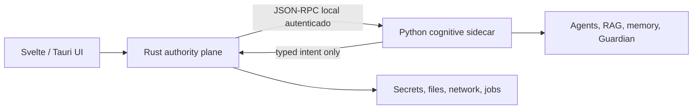

# Arquitectura v0.4

## Decisión central

Rust es el plano de autoridad. Python es el plano cognitivo aislado. La interfaz Svelte visualiza, configura y solicita operaciones; no conserva secretos ni aplica efectos externos.

El puente Rust genera un token efímero, permite una lista cerrada de métodos y inicia el sidecar con un entorno reducido. No hereda las credenciales de `.env`. El token no se escribe en trazas.

## Límites de autoridad

| Capa | Puede | No puede |
|---|---|---|
| UI | Preguntar, mostrar progreso, pedir pausa | Leer secretos, publicar, aprobarse a sí misma |
| Rust | Guardar secretos, red, archivos, pausa, validar intents | Delegar autoridad sin validación |
| Python | Planificar, recuperar contexto, evaluar, proponer | Shell libre, leer `.env`, publicar directamente |

La pausa global vive en Rust. Antes de cada RPC, Rust sincroniza su estado con el sidecar y bloquea nuevas acciones cognitivas locales, como una prueba narrativa. Las consultas y una cancelación siguen disponibles.

## Persistencia y recuperación

- SQLite es la fuente transaccional: checkpoints, eventos, conversaciones, memorias, trazas y decisiones de reutilización.
- FTS5, `sqlite-vec` y el grafo editorial son índices locales reconstruibles.
- Cada tool genera eventos `started` y finales con argumentos redactados, evidencia, costo y resultado resumido.
- Los workfows LangGraph existentes y el motor narrativo conservan checkpoints para replay o reanudación.

## RPC operativo

El bridge solo publica `operations.chat`, `operations.context`, `tools.timeline`, `memory.search`, `rag.retrieve_v3`, `story.test`, `run.progress`, `run.cancel` y `agent.capabilities`. El handshake exige versión y token. Errores inesperados se devuelven como error interno saneado.

`ActionIntent@1` describe propuestas administrativas. Rust rechaza intents con secretos, estado falsamente autorizado o identidad inválida; un intent no es un efecto.

## Estados de entrega

- Implementado: contratos, persistencia, chat, timeline, historia propia, RAG v3, filtros Reddit y bridge autenticado.
- Degradado: el endpoint local de RAG usa embeddings deterministas solo para desarrollo cuando no hay un modelo local evaluado.
- Experimental: modelos remotos del registro y `tencent/hy3:free` como fallback de disponibilidad limitada.
- Planificado: TTS/Whisper/FFmpeg reales, publicación Meta y worker remoto.
