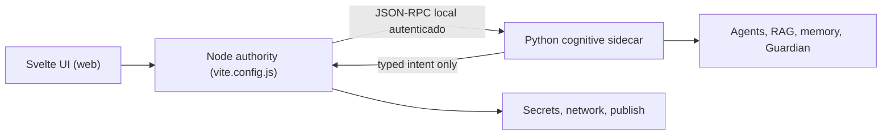

# Arquitectura v0.8 (web pura)

## Decisión central

El **Node authority** (`vite.config.js`) es el plano de autoridad: custodia
secretos/`.env`, hace el routing real de modelos (`model.complete`), la búsqueda
en Pexels y la publicación, y arranca el sidecar con una lista cerrada de métodos.
Python es el plano cognitivo aislado. La interfaz Svelte visualiza, configura y
solicita operaciones; no conserva secretos ni aplica efectos externos.

> **Migración fuera de Tauri (Fase 4):** el plano de autoridad vivía en Rust
> (`src-tauri/`). Como el Node authority ya cubre todo lo web-crítico, `src-tauri/`
> fue **eliminado** (app web pura, doble-clic — ver [COMO_INICIAR.md](COMO_INICIAR.md)).
> Abajo se lee "Rust" por el diseño histórico; hoy ese rol lo cumple el Node authority.

El puente Rust genera un token efímero, permite una lista cerrada de métodos y inicia el sidecar con un entorno reducido. No hereda las credenciales de `.env`. El token no se escribe en trazas. El plano cognitivo compila prompts con capas separadas para política, persona, perfil narrativo, rol, contexto y verificación, de forma que el estilo del agente no pueda alterar autoridad ni permisos.

## Límites de autoridad

| Capa | Puede | No puede |
|---|---|---|
| UI | Preguntar, mostrar progreso, pedir pausa | Leer secretos, publicar, aprobarse a sí misma |
| Rust | Guardar secretos, red, archivos, pausa, validar intents | Delegar autoridad sin validación |
| Python | Planificar, recuperar contexto, evaluar, proponer | Shell libre, leer `.env`, publicar directamente |

La pausa global vive en Rust. Al activarse se sincroniza con el sidecar, cancela cooperativamente ejecuciones cognitivas activas y bloquea nuevas acciones locales, como una prueba narrativa. Las consultas y una cancelación siguen disponibles.

## Persistencia y recuperación

- SQLite es la fuente transaccional: checkpoints, eventos, conversaciones, memorias, trazas y decisiones de reutilización.
- FTS5, `sqlite-vec` y el grafo editorial son índices locales reconstruibles.
- Cada tool genera eventos `started` y finales con argumentos redactados, evidencia, costo y resultado resumido.
- Los turnos del chat se guardan como hash y longitud, no como texto bruto, para que una fuente externa pegada por el usuario no contamine la memoria durable.
- Los workfows LangGraph existentes y el motor narrativo conservan checkpoints para replay o reanudación.

## RPC operativo y herramientas anidadas

El bridge publica una lista cerrada que ahora incluye `content.run` y `performance.learn`, además de chat, contexto, timeline, memoria, RAG, pruebas narrativas, progreso, cancelación y capacidades. Durante una ejecución Python puede solicitar únicamente `model.health`, `model.complete`, `reddit.list_signals` y `meta.metrics.read`; Rust valida la petición, usa la credencial y devuelve datos estructurados. El handshake exige versión y token. Errores inesperados se devuelven como error interno saneado.

`ActionIntent@1` describe propuestas administrativas. Rust rechaza intents con secretos, estado falsamente autorizado o identidad inválida; un intent no es un efecto.

## Estados de entrega

- Implementado: contratos, persistencia, chat, timeline, vertical Reddit oficial, modelos remotos gobernados, historia propia, duración/QC, RAG v3, métricas Meta y aprendizaje reversible.
- Degradado: si BGE-M3 o su reranker no están instalados localmente se usa un embedding determinista marcado exclusivamente como desarrollo.
- Temporal: `tencent/hy3:free` se omite automáticamente después del 21 de julio de 2026; continúan Qwen, Kimi y Nemotron según salud.
- Planificado: TTS/Whisper/FFmpeg reales, publicación/reconciliación Meta y worker remoto.
